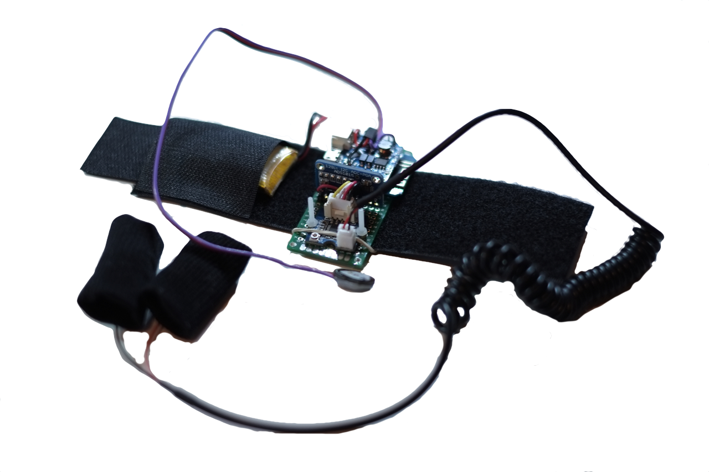

# Pulse and GSR monitor
Portable wrist device for measuring pulse and GSR. Reading from the sensors are streamed over WiFi to server which calculates heart rates and visualise it. The devices were designed and build for theatre performance, more info [here](https://gz.technology/project/the-hairs-of-your-head-are-numbered).

## Hardware
- ESP8266-12E
- [Pulse sensor](https://www.sparkfun.com/products/11574)
- [GSR sensor](https://www.seeedstudio.com/Grove-GSR-sensor-p-1614.html)

## Built With
* [Atom](https://atom.io) - An amazing text editor
* [PlatformIO](https://platformio.org) - An ecosystem for embedded development

## License
This project is licensed under [MIT license](http://opensource.org/licenses/mit-license.php)

## Project status
- Prototype built and tested.
- Serie of 30 devices built
- Firmware completed.
